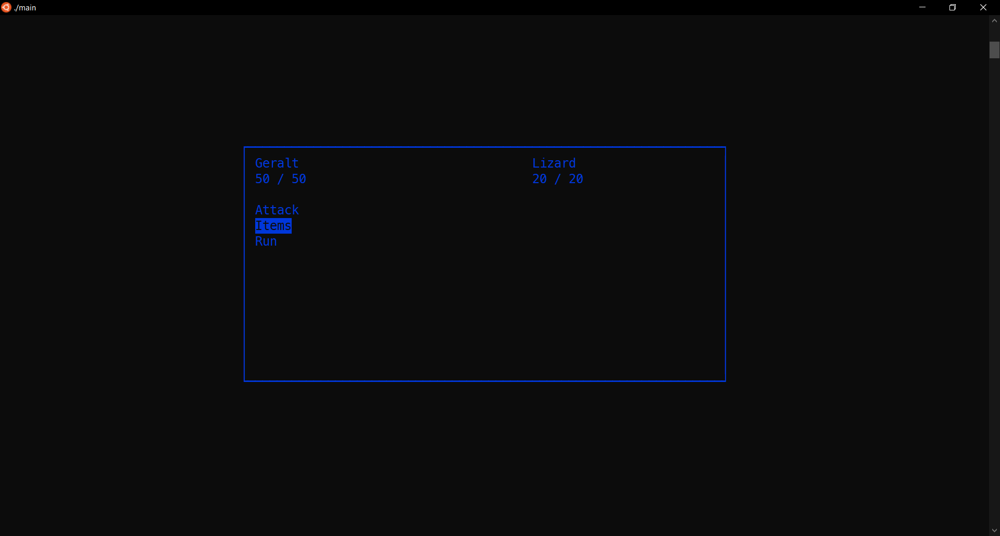

# Questclad
 
 Authors:  
 [Charles Alaras](https://github.com/charlesalaras)  
 [Roth Vann](https://github.com/swampape)  
 [Yazhou Shen](https://github.com/yazhoushenphillip)

## Project Description
 Questclad is a text-based role-playing game featuring a rich story, turn-based combat, and a plethora of items to battle, consume, and defend with. The game runs directly in terminal using ASCII based graphics to display enemies, environments, and rich user interfaces. From the main menu, you will be able to create / load save states, in order to progress through distinct areas  to get the Carvysian Talisman. On your journey, you will face challenging enemies, meet many characters, and find helpful aides that offer items for your quest.  
### Motivation
 As we know, League of Legends is a very popular role-playing game. Our group wants to create a text-based role-playing game to get a better understanding of how this game works. This project can help us better understand how hard it is to create a good game. A text-based role-playing game has many facets that test our understanding of software design. These include the creation of a story, the formation of game mechanics, abstraction of internal systems, and debugging a large project with interdependent relationships.  
  
### Tools
 * [C++](https://www.cplusplus.com/) - Programming language used for our project.
 * [ncurses](https://invisible-island.net/ncurses/announce.html) - Programming library that allows for the creation of a text based GUI on a terminal.  
    * Installation for Linux: `sudo apt-get install lib32ncurses-dev`. ncurses is only necessary for development and is not an executable dependency.  
 * [valgrind](https://valgrind.org/) - Memory management tool used for debugging memory issues.  
    * Installation for Linux: `sudo apt-get install valgrind`. valgrind is only necessary for development and is not an executable dependency.  
 * [gdb](https://www.gnu.org/software/gdb/) - Debugger for C++ programs.  
    * Installation for Linux: `sudo apt-get install gdb`. gdb is only necessary for development and is not an executable dependency.  
 * [GoogleTest](https://github.com/google/googletest) - Testing suite to provide frameworks for building tests.  
  
### Input / Output
The input and output of this project will be based upon important interactions with user interfaces. The initial input will either be no command line argument (for a first time session), or a command line argument to load a save file created from a previous session. From there, the player will be placed into a menu to either load a new game, create a new game, or view the credits. After selecting an option in the menu, the main gameplay loop will start, where a player will progress through a story, passing through three types of events in four areas: battle, shop, or dialogue. Output in every event will be an ASCII based image, a textual description, and a graphical user interface displaying options a player can choose based on the event. Within events, the main way a player interacts with the game is through keystrokes mapped to various options (attack, run, inventory, use item).  
  
### Design Patterns
The two design patterns that will be used in our project is the visitor pattern and the abstract factory pattern.  

  * Visitor
    * We will be implementing the visitor pattern for the very important interactions between items and the user. Items are a very integral part of the game, and it is important that they have interactions that work correctly. However, the issue is that how does the user know what the item does, and how does the item know what to modify. The visitor pattern solves this by turning the User into a visitor, and the item calling a specified bonus to apply based on what type of effect it should give.
 * Abstract Factory
    * We are planning on having a large variety of enemy types which can include variants of various types. Since the number of enemies and variants could be very large, the number of classes we would have to create would be very messy. To fix this we plan on having an abstract factory that allows us to get a enemy type factory that would generate enemy variants. Abstract Factory can also see usefulness in handling various events and the orchestration of each functional part of the events.

## Class Diagram
### Interface
The interface class is implemented with the composite pattern. Also included in this diagram are item and skill classes (not related to Interface, but are used in Interface).

### Enemy
The enemy class is implemented with the Abstract Factory pattern. Also included in this diagram are other classes necessary for the game including Event, Game, Damagables, and Character.

 ## Screenshots

 ## Installation/Usage
 ### Important Warning About Memory
 **PLEASE READ**  
 The library used for this project (ncurses) to provided text based graphics will leak memory. This is not memory that is leaked by the user, but memory that is leaked by ncurses. This is intended. We have done all we can to try and remove whatever memory leaks the program may create, but some memory may still leak (when run in Valgrind, it will show up in the "Still Reachable" section). For more information, please see [this FAQ in ncurses' documentation](https://invisible-island.net/ncurses/ncurses.faq.html#config_leaks).
 ### Getting Started
 - Assure that you are running the program at a feasible terminal size (most playtests were done at a size of about 33x135 characters).
 - You can easily change your buffer size by looking [here](https://www.google.com/?q=increase+terminal+buffer+size).
 - Depending on different terminals, some things can go wrong: for example, in program terminals for IDEs, SSH'd terminals, and old terminals will most likely not be supported. This is because ncurses uses a color module that some terminals do not support. See the next bullet point for workarounds.
 - The program only runs on Linux terminals as of first tested release. It is free to download [here](https://www.linux.org/). There are many distributions to choose from, we recommend Ubuntu as it is what was used for running. If you are a Windows user, you can use **Windows Subsystem Linux**, a Linux terminal emulator for Windows. Find it [here](https://docs.microsoft.com/en-us/windows/wsl/install-win10).
 ### Running the Game
 Running the game is very simple. Here are the common ways:
 #### .ZIP
 1. On Github, navigate to this repository, and find a green button labelled "Code", and it will open a drop-down menu.
 2. Click "Download ZIP", and it should download all contents of the repository.
 3. Once downloaded, navigate to the zip and extract it.
 4. Open up terminal.
 5. Using [shell commands](https://www.geeksforgeeks.org/basic-shell-commands-in-linux/), navigate to your extracted zip.
 6. Type in the command `./main` and the game should start automatically.
 #### Git Clone
 1. On Github, navigate to this repository, and find a green button labelled "Code", and it will open a drop-down menu.
 2. Copy the HTTPS link that shows up under the "Clone" section.
 3. Open up terminal.
 4. Using [shell commands](https://www.geeksforgeeks.org/basic-shell-commands-in-linux/), navigate to where you would like to place the game.
 5. Type in `git clone <https-link>`, and it will clone this repository into your desired folder.
 6. Type in the command `./main` and the game should start automatically.
 ## Testing
 Testing a game is an incredibly difficult task, as many parts cannot be tested without their underlying dependencies. Nonetheless, we pushed forward.
 ### Unit Testing
 Unit testing was done by isolating as many classes that we could, and testing their specific functions. Often in testing we would have to "mock" what the game would do to stimulate these objects, and see how the specific classes would react, observing if the behavior works how we intend it to. Often times, some classes could not be tested fully, because they did not have anything to test (apart from values that we knew could never happen, because values are either set in a small user range, or set by us). However, any functions that we could test we did.
 ### GUI Testing
 There was not much that could be done with GUI testing, since ncurses is already assumed to be tested. The only pitfall would come from us not using the ncurses library correctly, or forgetting something. Thus, there were not many logical errors that could occur, rather mistakes on the programmer's part that we made sure to account for.
 ### Product Testing
 Once we integrated all parts of the game together, we were able to move into a stage known as playtesting. Since much of the game is GUI based, we ran through whatever possible combinations of inputs a user could choose and tested whether that would break things. The testing we did is essentially making sure that our game is bulletproof, and that a user cannot access things they are not supposed to, only acting in constraints to the input line we give (interfaces). We tested a various amount of nonsense inputs, tried breaking things in the background and changing different parameters. While its impossible to account for everything, we did our best to isolate and test every variable we possibly could.
