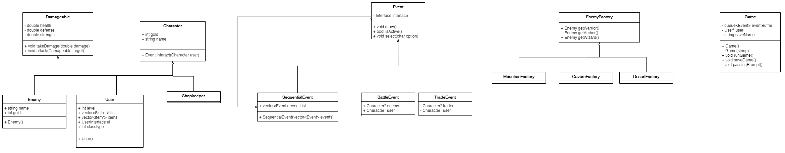

# Questclad
 
 Authors:  
 [Charles Alaras](https://github.com/charlesalaras)  
 [Roth Vann](https://github.com/swampape)  
 [Yazhou Shen](https://github.com/yazhoushenphillip)

## Project Description
 Questclad is a text-based role-playing game featuring a rich story, turn-based combat, and a plethora of items to battle, consume, and defend with. The game runs directly in terminal using ASCII based graphics to display enemies, environments, and rich user interfaces. From the main menu, you will be able to create / load save states, in order to progress through distinct areas  to get the Carvysian Talisman. On your journey, you will face challenging enemies, meet many characters, and find helpful aides that offer items for your quest.  
### Motivation
 As we know, League of Legends is a very popular role-playing game. Our group wants to create a text-based role-playing game to get a better understanding of how this game works. This project can help us better understand how hard it is to create a good game. A text-based role-playing game has many facets that test our understanding of software design. These include the creation of a story, the formation of game mechanics, abstraction of internal systems, and debugging a large project with interdependent relationships.  
  
### Tools
 * [C++](https://www.cplusplus.com/) - Programming language used for our project.
 * [ncurses](https://invisible-island.net/ncurses/announce.html) - Programming library that allows for the creation of a text based GUI on a terminal.  
    * Installation for Linux: `sudo apt-get install lib32ncurses-dev`. ncurses is only necessary for development and is not an executable dependency.  
 * [valgrind](https://valgrind.org/) - Memory management tool used for debugging memory issues.  
    * Installation for Linux: `sudo apt-get install valgrind`. valgrind is only necessary for development and is not an executable dependency.  
 * [gdb](https://www.gnu.org/software/gdb/) - Debugger for C++ programs.  
    * Installation for Linux: `sudo apt-get install gdb`. gdb is only necessary for development and is not an executable dependency.  
 * [GoogleTest](https://github.com/google/googletest) - Testing suite to provide frameworks for building tests.  
  
### Input / Output
The input and output of this project will be based upon important interactions with user interfaces. The initial input will either be no command line argument (for a first time session), or a command line argument to load a save file created from a previous session. From there, the player will be placed into a menu to either load a new game, create a new game, or view the credits. After selecting an option in the menu, the main gameplay loop will start, where a player will progress through a story, passing through three types of events in four areas: battle, shop, or dialogue. Output in every event will be an ASCII based image, a textual description, and a graphical user interface displaying options a player can choose based on the event. Within events, the main way a player interacts with the game is through keystrokes mapped to various options (attack, run, inventory, use item).  
  
### Design Patterns
The two design patterns that will be used in our project is the composite pattern and the abstract factory pattern.  

  * Strategy
    * We will be implementing the Character class using the strategy pattern. The character will have a few different components such as armor, weapon, skills, and etc. Since each part can have multiple interchangeable components it would be hard to hardcode in classes for each componnent. The strategy pattern allows us to define a character as a grouping of a few different interfaces and therefore we can have interchangable class for each character option.
 * Abstract Factory
    * We are planning on having a large variety of enemy types which can include variants of various types. Since the number of enemies and variants could be very large, the number of classes we would have to create would be very messy. To fix this we plan on having an abstract factory that allows us to get a enemy type factory that would generate enemy variants. Abstract Factory can also see usefulness in handling various events and the orchestration of each functional part of the events.

## Class Diagram
### Interface
The interface class is implemented with the composite pattern. Also included in this diagram are item and skill classes (not related to Interface, but are used in Interface).

### Enemy
The enemy class is implemented with the Abstract Factory pattern. Also included in this diagram are other classes necessary for the game including Event, Game, Damagables, and Character.

 
 > ## Phase III
 > You will need to schedule a check-in with the TA (during lab hours or office hours). Your entire team must be present. 
 > * Before the meeting you should perform a sprint plan like you did in Phase II
 > * In the meeting with your TA you will discuss: 
 >   - How effective your last sprint was (each member should talk about what they did)
 >   - Any tasks that did not get completed last sprint, and how you took them into consideration for this sprint
 >   - Any bugs you've identified and created issues for during the sprint. Do you plan on fixing them in the next sprint or are they lower priority?
 >   - What tasks you are planning for this next sprint.

 > ## Final deliverable
 > All group members will give a demo to the TA during lab time. The TA will check the demo and the project GitHub repository and ask a few questions to all the team members. 
 > Before the demo, you should do the following:
 > * Complete the sections below (i.e. Screenshots, Installation/Usage, Testing)
 > * Plan one more sprint (that you will not necessarily complete before the end of the quarter). Your In-progress and In-testing columns should be empty (you are not doing more work currently) but your TODO column should have a full sprint plan in it as you have done before. This should include any known bugs (there should be some) or new features you would like to add. These should appear as issues/cards on your Kanban board. 
 
 ## Screenshots
 > Screenshots of the input/output after running your application
 ## Installation/Usage
 > Instructions on installing and running your application
 ### Important Warning About Memory
 **PLEASE READ**  
 The library used for this project (ncurses) to provided text based graphics will leak memory. This is not memory that is leaked by the user, but memory that is leaked by ncurses. This is intended. We have done all we can to try and remove whatever memory leaks the program may create, but some memory may still leak (when run in Valgrind, it will show up in the "Still Reachable" section). For more information, please see [this FAQ in ncurses' documentation](https://invisible-island.net/ncurses/ncurses.faq.html#config_leaks).
 ## Testing
 > How was your project tested/validated? If you used CI, you should have a "build passing" badge in this README.
 
